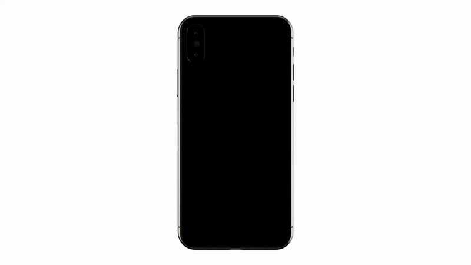

<p align="center">
    <h1 align="center" style="opacity: 0.8;color:#FE4E16;font-weight:700;">ANTOON</h1>
    <p align="center"><span style="opacity: 0.8;font-size:15px;font-weight:700;">개미는 오늘도 열심히 툰툰!</span></p>
    <p align="center" style="margin-top:-18px;"><span style="font-size:11px;font-weight:700;">디프만 1팀 최강 FE</span> </p>
    <div style="text-align:center;" align="center">
        
    </div>
    <br />
</p>

### 프로젝트 소개 🐛
```
내 취향과 맞는 웹툰은 뭘까? 이런 고민을 하는 당신에게!
나와 비슷한 취향을 가진 사람들이 어떤 웹툰을 보는지
내가 좋아하는 웹툰은 무엇인지
개미는툰툰을 통해 취향을 공유해요!!!
```

### **개미는 툰툰** FE 🐜
<div style="margin:0 auto;" align="center">
    <table style="width: 800px; margin: 50px auto;">
        <thead>
            <th style="text-align:center;">이병현</th>
            <th style="text-align:center;">김민지</th>
            <th style="text-align:center;">최푸름</th>
        </thead>
        <tbody>
            <td></td>
            <td></td>
            <td></td>
        </tbody>
        <tfoot>
            <td style="text-align:center;"><a href="https://github.com/Tolluset">이병현</a></td>
            <td style="text-align:center;"><a href="https://github.com/mnxmnz">김민지</a></td>
            <td style="text-align:center;"><a href="https://github.com/choipureum">최푸름</a></td>
        </tfoot> 
    </table>
</div>

<div style="text-align:center;" align="center">
    
</div>
    
<br />
<br />

### 프로젝트 소개 🐛

---


### 🌐 서비스 주소
- [Antoon Web](https://antoon.fun/)
- [Antoon Api](https://api.antoon.fun/swagger)

